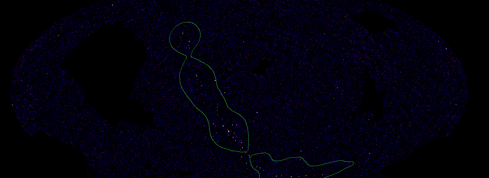

This is a fork of HEASoft `varmosaic` tool. See [varmosaic.txt](varmosaic.txt) for more details.

This variation repixelizes into `healpix` maps, and produces certain agregations (such as total variance-weighted mean mosaic in Healpix).

```bash
HP_DATA=$HOME/hp_data
```

Example output image:



